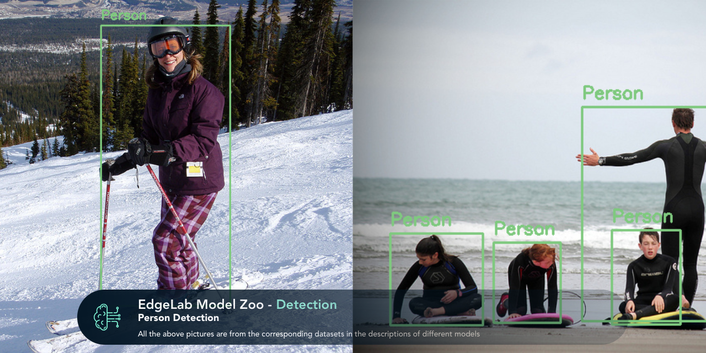
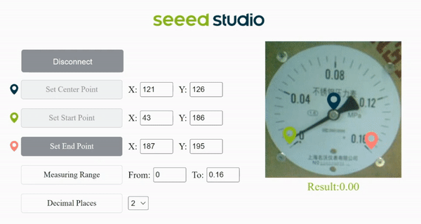

# SenseCraft Model Assistant by Seeed Studio

  
  <h3> <a href="https://sensecraftma.seeed.cc"> Documentation </a> | <a href="https://github.com/Seeed-Studio/sscma-model-zoo"> Model Zoo </a>  </h3>

English | [简体中文](README_zh-CN.md)

## Introduction

Seeed SenseCraft Model Assistant (or simply SSCMA) is an open-source project focused on embedded AI. We have optimized excellent algorithms from [OpenMMLab](https://github.com/open-mmlab) for real-world scenarios and made implementation more user-friendly, achieving faster and more accurate inference on embedded devices.

## What's included?

Currently we support the following directions of algorithms:

### 🔍 Anomaly Detection
In the real world, anomalous data is often difficult to identify, and even if it can be identified, it requires a very high cost. The anomaly detection algorithm collects normal data in a low-cost way, and anything outside normal data is considered anomalous.

### 👁️ Computer Vision
Here we provide a number of computer vision algorithms such as object detection, image classification, image segmentation and pose estimation. However, these algorithms cannot run on low-cost hardware. SSCMA optimizes these computer vision algorithms to achieve good running speed and accuracy in low-end devices.

### ⏱️ Scenario Specific
SSCMA provides customized scenarios for specific production environments, such as identification of analog instruments, traditional digital meters, and audio classification. We will continue to add more algorithms for specified scenarios in the future.

## Features

### 🤝 User-friendly
SSCMA provides a user-friendly platform that allows users to easily perform training on collected data, and to better understand the performance of algorithms through visualizations generated during the training process.

### 🔋 Models with low computing power and high performance
SSCMA focuses on end-side AI algorithm research, and the algorithm models can be deployed on microprocessors, similar to [ESP32](https://www.espressif.com.cn/en/products/socs/esp32), some [Arduino](https://arduino.cc) development boards, and even in embedded SBCs such as [Raspberry Pi](https://www.raspberrypi.org).

### 🗂️ Supports multiple formats for model export
[TensorFlow Lite](https://www.tensorflow.org/lite) is mainly used in microcontrollers, while [ONNX](https://onnx.ai) is mainly used in devices with Embedded Linux. There are some special formats such as [TensorRT](https://developer.nvidia.com/tensorrt), [OpenVINO](https://docs.openvino.ai) which are already well supported by OpenMMLab. SSCMA has added TFLite model export for microcontrollers, which can be directly converted to [TensorRT](https://developer.nvidia.com/tensorrt), [UF2](https://github.com/microsoft/uf2) format and drag-and-drop into the device for deployment.

## Application Examples

### Object Detection

### Pointer Meter Recognition

### Digital Meter Recognition

More application examples can be found in [Model Zoo](https://github.com/Seeed-Studio/sscma-model-zoo)。

## Acknowledgement

SSCMA referenced the following projects:

- [OpenMMLab](https://openmmlab.com/)
- [ONNX](https://github.com/onnx/onnx)
- [NCNN](https://github.com/Tencent/ncnn)
- [TinyNN](https://github.com/alibaba/TinyNeuralNetwork)

## License

This project is released under the [MIT license](LICENSES).
