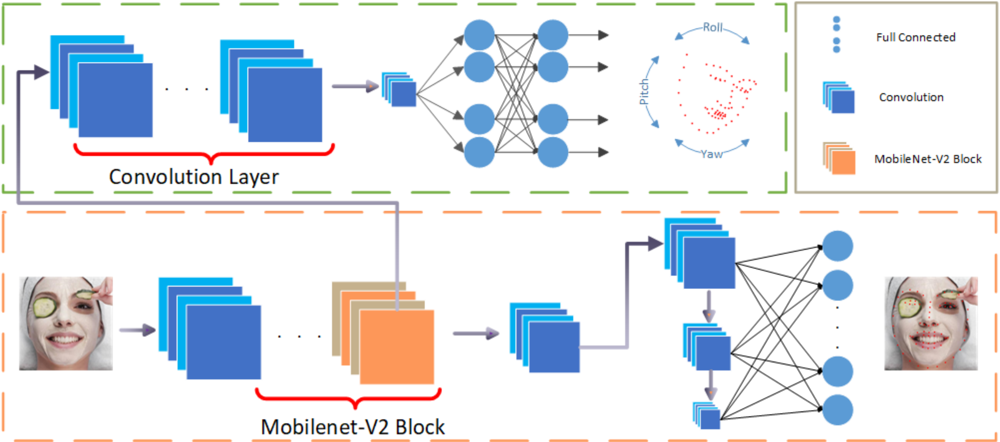

# PFLD

> [PFLD: A Practical Facial Landmark Detector](https://arxiv.org/pdf/1902.10859.pdf)

## Abstract

Being accurate, efficient, and compact is essential to a facial landmark detector for practical use. To simultaneously
consider the three concerns, this paper investigates a neat model with promising detection accuracy under wild
environments (e.g., unconstrained pose, expression, lighting, and occlusion conditions) and super real-time speed on a
mobile device. More concretely, we customize an endto-end single stage network associated with acceleration techniques.
During the training phase, for each sample, rotation information is estimated for geometrically regularizing landmark
localization, which is then NOT involved in the testing phase. A novel loss is designed to, besides considering the
geometrical regularization, mitigate the issue of data imbalance by adjusting weights of samples to different states,
such as large pose, extreme lighting, and occlusion, in the training set. Extensive experiments are conducted to
demonstrate the efficacy of our design and reveal its superior performance over state-ofthe-art alternatives on
widely-adopted challenging benchmarks, i.e., 300W (including iBUG, LFPW, AFW, HELEN, and XM2VTS) and AFLW. Our model can
be merely 2.1Mb of size and reach over 140 fps per face on a mobile phone(Qualcomm ARM 845 processor) with high
precision, making it attractive for large-scale or real-time applications. We have made our practical system based on
PFLD 0.25X model publicly available at http://sites.google. com/view/xjguo/fld for encouraging comparisons and
improvements from the community.
<div align=center>

</div>

## Results and Models

    TODO

## Citation

```latex
@article{guo2019PFLD,
    title={PFLD: A Practical Facial Landmark Detector},
    author={Xiaojie Guo, Siyuan Li, Jinke Yu, Jiawan Zhang, Jiayi Ma, Lin Ma, Wei Liu, and Haibin Ling},
    journal={arXiv preprint arXiv:1902.10859,},
    year={2019}
}
```