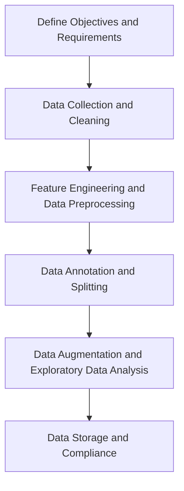
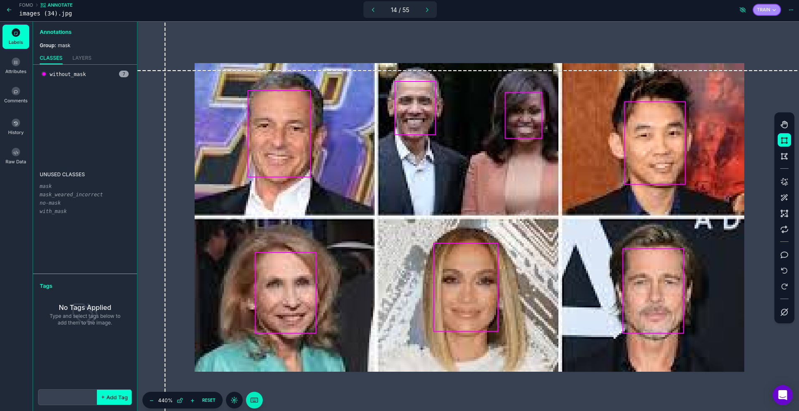
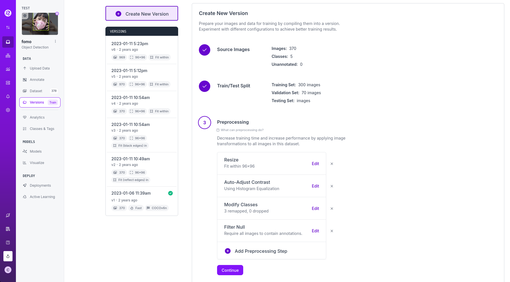
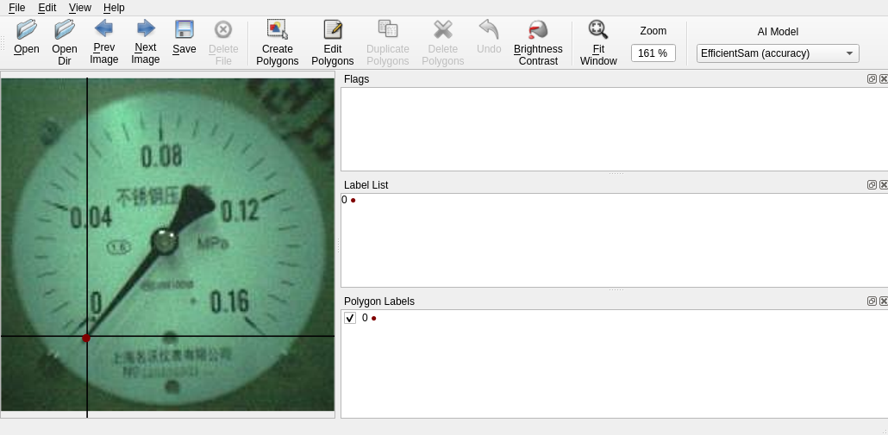

# Custom Datasets

SSCMA supports a variety of datasets in different formats. You can create your own datasets or convert other datasets into supported formats for use in SSCMA by following certain rules. Generally, creating a dataset involves the following steps:



First, define the objectives and requirements, followed by data collection and cleaning, which involves obtaining data from various sources and cleaning it to remove duplicates, handle missing values, and correct errors.

Next, feature engineering and data preprocessing are necessary, including extracting useful features from raw data, creating new features, and performing normalization, standardization, and encoding operations on the data. Further, we proceed with data annotation and splitting, which includes not only annotating the required data but also dividing the dataset into training, validation, and testing sets (if needed).

Finally, data augmentation and exploratory data analysis aim to improve data diversity through data augmentation and understand the distribution of data and the relationships between features through exploratory data analysis.

After all these steps, data storage is required, ensuring that the creation and use of the entire dataset comply with legal regulations and ethical standards. These steps together ensure the quality and applicability of the dataset, laying a solid foundation for training effective machine learning models. In this section, we mainly introduce the annotation methods for datasets.

## Annotation Basics

For models trained by traditional supervised learning algorithms, the process of annotating datasets is crucial as it determines the quality of the trained models. Common annotation methods include:

- **Manual Annotation:** Manually annotating the dataset for each sample ensures accuracy but is slower.
- **Semi-Automatic Annotation:** Applying manual annotation results to other datasets to reduce annotation time, but the accuracy may be reduced.
- **Automatic Annotation:** Using algorithmic models to automatically annotate data, such as keyword extraction, text classification, etc. This can improve annotation efficiency, but the accuracy may also be affected.

### Bounding Box Annotation

In object detection tasks, bounding boxes are a common annotation method used to mark the location of targets in images, usually represented by the coordinates of the top-left and bottom-right corners. The format for bounding box annotation is usually `(x1, y1, x2, y2)`, where `(x1, y1)` are the top-left coordinates, and `(x2, y2)` are the bottom-right coordinates. When performing bounding box annotation, note the following key points:

- **Appropriate Box Size:** The annotation box should just enclose the target object, not too loose or too tight. Improper sizes can lead to inaccurate target boxes during inference or severe target jitter in video image detection.
- **Appropriate Box Position:** The position of the annotation box needs to be accurate and not too far off. Inaccurate positions can affect the training results of the model.
- **Multi-视角 Materials:** Rich multi-perspective materials are needed to cover various camera angles to improve the model's versatility.
- **Annotate Occluded Targets:** Even if the target object is occluded by other objects, it should be annotated.
- **Edge Rule:** Annotation boxes should be drawn tightly against the edges of the target object, neither too small nor too large.
- **Overlap Rule:** When two target objects overlap, as long as it's not more than half occlusion, it's acceptable to draw boxes, allowing for overlapping parts.
- **Independence Rule:** Each target object needs an individual box; multiple targets should not be merged into one box.
- **No-Box Rule:** Images that are unclear, too dark, overexposed, or do not meet special project rules should not be boxed.
- **Boundary Check:** Ensure that box coordinates are not on the image boundaries to prevent out-of-bounds errors when loading data or extending data.
- **Small Target Rule:** For small targets, as long as they can be distinguished by the human eye, they should be marked. Depending on the algorithm's requirements, decide whether to include these samples in training.

### Keypoint Annotation

In tasks related to Pose, such as pointer Meter, keypoint annotation is a common method used to mark the location of key points in images. The format for keypoint annotation is usually `(x, y)`, where `(x, y)` are the coordinates of the key point. When performing keypoint annotation, note the following details:

- **Data Preparation:** Ensure images are clear, unobstructed, and key points are visible for subsequent annotation work.
- **Annotation Standards:** Define the types and locations of key points, clarify annotation standards, such as naming rules for key points, coordinate system selection, etc., to maintain consistency and accuracy in annotation.
- **Annotation Order and Consistency:** Key points do not need a fixed order, but the annotation order for the same part in each image should be consistent.
- **Handle Occluded Points:** Points that are obstructed should also be annotated to consider this situation during model training.
- **Visibility of Key Points:** Annotation tools may not directly indicate whether key points are visible, requiring adjustments in subsequent processing to meet the format requirements of specific algorithms.
- **Avoid Overlap:** Each key point must and can only fall into one box, not a second box.
- **Quality Check:** After initial annotation, conduct a quality check to ensure all key points are correctly annotated, with no omissions or errors.

### Anomaly Detection Dataset Creation

In tasks such as vibration or audio anomaly detection, datasets do not require special annotation, but we still need to manually determine parameters to ensure effective model training.

#### N-Axis Accelerometer

- First, determine the device's sampling frequency, usually 100Hz, then determine the time length based on the sampling frequency and data length, i.e., sample_rate. This parameter represents the number of data points in a piece of data and is decisive for the effect of anomaly detection.
- Discrete accelerometer sampling data first undergoes preprocessing to reduce signal noise at high sampling rates. The factor parameter is crucial; adjusting it affects the model's sensitivity. This parameter can be understood as discarding the inaccuracy after a certain number of decimal places. A larger value means fewer decimal places are discarded, while a smaller value means more decimal places are discarded.
  - Fan anomaly detection (detection of speed changes is also required): Due to the simple waveform produced by fan movement and a small movement state space, errors should not be discarded. The preprocessing factor in the dataset creation tool should be increased; otherwise, it will be impossible to judge speed changes.
  - Robot arm anomaly detection: Due to the inherent mechanical error disturbances in the movement process of the robot arm and a large number of movement state spaces, the preprocessing factor in the dataset creation tool should be decreased; otherwise, it will not recognize minor jitter interference.
- Then, adjust parameters related to cutoff_freq, resize, scales based on the data visualization interface to obtain clear and stable images. This will not be discussed further.

#### Microphone

- Similar to the N-axis accelerometer, first determine the device's sampling frequency, usually 16kHz, then determine the time length based on the sampling frequency and data length, i.e., sample_rate. This parameter represents the number of data points in a piece of data and is decisive for the effect of anomaly detection.
- Window length (n_fft) determines the size of the STFT window, affecting frequency resolution. A larger window provides better frequency resolution but reduces time resolution, so it needs to be determined in combination with the sampling frequency and data length.
- Overlap length (hop_length) determines the degree of overlap between windows. A smaller overlap can improve time resolution but may introduce artifacts at window boundaries.
- The n_mels parameter determines the number of Mel filter banks, which affects the vertical resolution of the spectrogram. Increasing n_mels provides more detailed frequency information but also increases computational complexity.
- By adjusting the above parameters, obtain clear and stable spectrograms for use in anomaly detection tasks.

## Dataset Annotation Tools

Commonly used data annotation tools include:

- [Labelme](https://github.com/wkentaro/labelme): An open-source tool for image annotation, supporting various annotation formats such as COCO, PASCAL VOC, etc.
- [LabelImg](https://github.com/heartexlabs/labelImg): A tool for image annotation, supporting various annotation formats such as PASCAL VOC, YOLO, etc.
- [Labelbox](https://labelbox.com/): An online annotation tool, supporting annotation of images, text, video, etc., with various annotation templates and custom annotation template functions.
- [Doccano](https://github.com/doccano/doccano): An open-source annotation tool for text classification and sequence annotation, supporting various annotation formats such as NER, POS, etc.
- [Annotator](https://github.com/openannotation/annotator): A lightweight online annotation tool, supporting annotation of images, text, audio, etc.
- [VGG Image Annotator (VIA)](https://gitlab.com/vgg/via): An open-source tool for image annotation, supporting various annotation formats such as PASCAL VOC, YOLO, etc.
- [COCO Annotator](https://github.com/jsbroks/coco-annotator): A web-based image and video annotation tool for tasks such as object detection, segmentation, and keypoint annotation.

For tasks like object detection and keypoint detection, we recommend using professional annotation tools like Roboflow and Labelme to improve annotation efficiency and quality.

### Roboflow Annotation

1. First, you need to [sign up for a Roboflow account](https://app.roboflow.com/login) and then log in to the Roboflow platform.

2. After logging in to Roboflow, click on `New Project` in the upper right corner to create a new project, select the corresponding annotation mode, such as Object Detection, Keypoint Detection, etc. Then proceed to the Project page and click Upload Data to upload image files.

3. On the Project page, click `Annotate` to enter the annotation interface, select Unannotated images, then draw rectangles or mark keypoints on the images by dragging the mouse, and enter label information in the attribute bar on the left. (Taking FOMO as an example)

    

4. After annotation is complete, on the Project page, click `Versions`, then click `Create New Version` to generate a version. During the version generation process, you need to choose the appropriate Source Images, Train/Test Split, Preprocessing, and Augmentation parameters, and finally click Create to create the version.

    

5. After the version is created, on the corresponding version page, you can click `Download Dataset` to download the dataset. In the pop-up dialog, choose the appropriate dataset format, then select the appropriate download method to download the dataset to your local machine.

    

:::tip

Before generating a version, you can first analyze the dataset on the Project page by clicking `Analyze` to view the dataset's statistical information, which can help you better understand the characteristics of the dataset and adjust annotation and training parameters accordingly for better training results. After completing the above steps, you can continue to upload more image files to expand the dataset, generate new versions, and train more complex models.

:::

### Labelme Annotation

1. First, you need to install Labelme, which can be done with the following command:

```sh
pip install labelme
```

2. Then, you can launch Labelme with the following command:

```sh
labelme
```

3. In Labelme, choose OpenDir to open the image folder, then select the corresponding annotation mode in Edit. For object detection tasks, select Create Rectangle, and for keypoint detection tasks, select Create Point. As shown in the figure, for the PFLD single-point keypoint detection task, annotate the keypoint at the end of the image pointer.

    

4. During the annotation process, you can use the mouse to drag to draw rectangles or mark keypoints, and then enter label information in the attribute bar on the right.

5. After annotation is complete, choose Save to save the annotation results. Labelme will generate a JSON file containing the image's annotation information.

    :::tip
    Labelme will automatically remember the last used annotation type during the annotation process, so you can use the shortcut key `Ctrl + N` to quickly switch annotations. Enable File -> Save Automatically to save automatically for each image. Labelme will generate a JSON file with the corresponding filename in the specified folder. We recommend turning off File -> Save With Image Data to reduce the size of the JSON files.
    :::

6. If you have not previously divided the training set, validation set, and test set, you can manually divide the annotated results into training, validation, and test sets according to a certain ratio, and then place the JSON files and image files into the corresponding folders.
