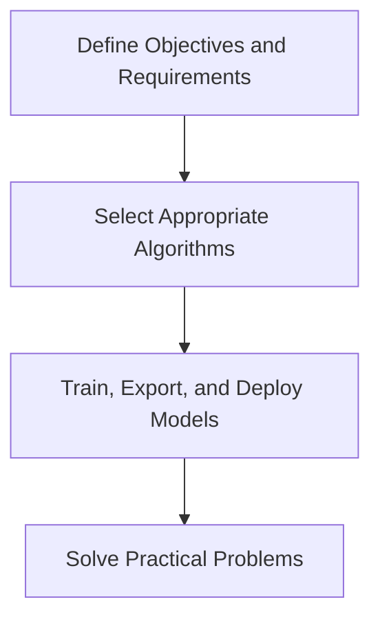
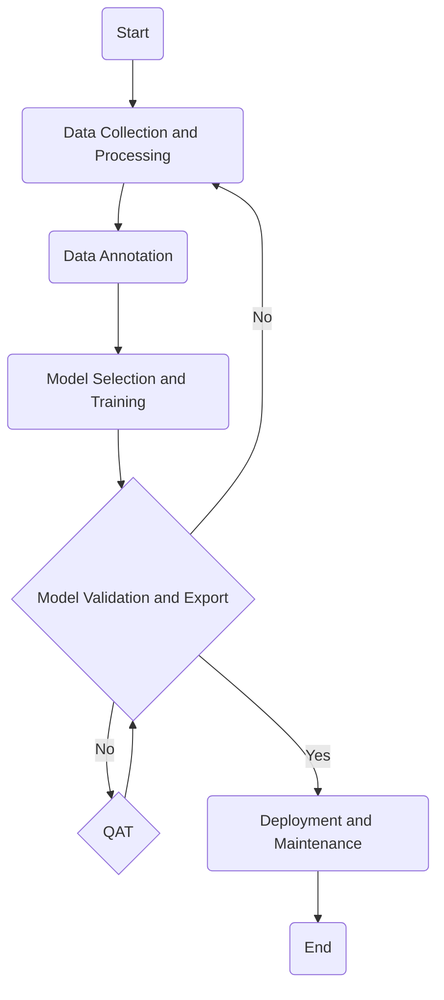

# Process Overview

Solving practical problems with specific algorithms is not a simple task; SSCMA typically divides it into the following steps. You can refer to the flowchart below to understand the entire process.

Currently, SSCMA offers a variety of algorithms. You can choose the appropriate algorithm based on your needs and solve practical problems by training, exporting, and deploying models. This chapter will further introduce how to use SSCMA to train, export, and deploy models. For common supervised learning tasks, the process using SSCMA is shown in the figure below:

## Data Collection and Processing

Collect relevant data and perform cleaning, formatting, and transformation to facilitate subsequent analysis and modeling.

:::tip

- Ensure the quality and relevance of the data.
- Handle missing values, outliers, and duplicate data.
- Engage in feature engineering to extract useful information.
- For methods of data collection and processing, please refer to [SSCMA - Public Datasets](../datasets/public).

:::

## Data Annotation

Annotate the data to provide the labels required for training machine learning models.

:::tip

- Ensure the accuracy and consistency of annotations.
- Consider using crowdsourcing or professional annotation teams.
- Define clear annotation guidelines.
- For methods of dataset annotation, please refer to [SSCMA - Custom Datasets](../datasets/custom) and [SSCMA - Dataset Formats and Expansion](../datasets/extension).

:::

## Model Selection and Training

Choose the appropriate machine learning model and train the model using the training dataset.

:::tip

- Select the right model based on the problem type (classification, regression, etc.).
- Adjust model parameters to optimize performance.
- Use methods like cross-validation to assess the model's generalization ability.

:::

### Epochs and Batch Size

Simply put, an Epoch refers to passing the entire training dataset through the neural network once, meaning the model learns from all training samples once. During training, the model goes through multiple Epochs to continuously optimize parameters, reduce errors, and improve the model's accuracy. Generally, the more Epochs, the higher the probability of the model fully converging, but it also increases training time. In SSCMA, you can set the number of training Epochs through the `max_epochs` parameter.

Batch Size refers to the number of samples used to update weights during each iteration in the training process, which affects training speed and model performance. Generally, its setting needs to be determined based on the specific problem and dataset.

### Optimizers and Learning Rates

An optimizer is an algorithm used to adjust model parameters during training to minimize the loss function. Common optimizers include SGD, Adam, AdamW, etc. The choice of optimizer significantly affects the model's training speed and performance. For most cases, the AdamW optimizer is a good choice, and you can set a specific optimizer through the `optim_wrapper` parameter.

The learning rate is the step size of the optimizer when updating model parameters. It determines the distance parameters move along the gradient descent direction during each iteration. The choice of learning rate significantly affects the model's training speed and final performance. Different algorithms and datasets may require different learning rates, and you can set the learning rate through the `base_lr` parameter. We recommend adjusting the learning rate based on the training loss curve.

- Too high learning rate: May lead to unstable training processes or even divergence.
- Too low learning rate: The training process will be very slow and may get stuck in local minima.

:::tip

For more information on training details, please refer to [SSCMA - Customization - Training and Validation Pipeline](../custom/pipelines) and [SSCMA - Customization - Optimizers](../custom/optimizer).

:::

## Model Validation and Export

Use validation and testing datasets to evaluate the model's performance and ensure that the model performs well on unseen data. Before deploying the model on embedded devices, you need to export the model in a format suitable for the target device. This process may include operations such as quantization, pruning, and graph optimization to reduce the model's size and computational load. These operations may affect the model's performance, so for exported models, we recommend validation before deployment.

:::tip

- Avoid overfitting, where the model performs well on training data but poorly on new data.
- If the model performs poorly, you may need to return to data preprocessing or model selection for adjustments.

:::

## QAT

If the performance of the quantized model is not satisfactory in the step [Model Validation and Export](#Model Validation and Export), you can consider using SSCMA's export tool's QAT (Quantization-Aware Training) feature to improve model accuracy. For models exported with QAT, you will need to re-validate.

## Deployment and Maintenance

Deploy the trained model to the production environment so that it can process actual data and provide predictions.

:::tip

- Ensure that the model's deployment environment is consistent with the training environment.
- Consider the model's scalability and maintainability.
- Regularly check the model's performance and update as needed.

:::
