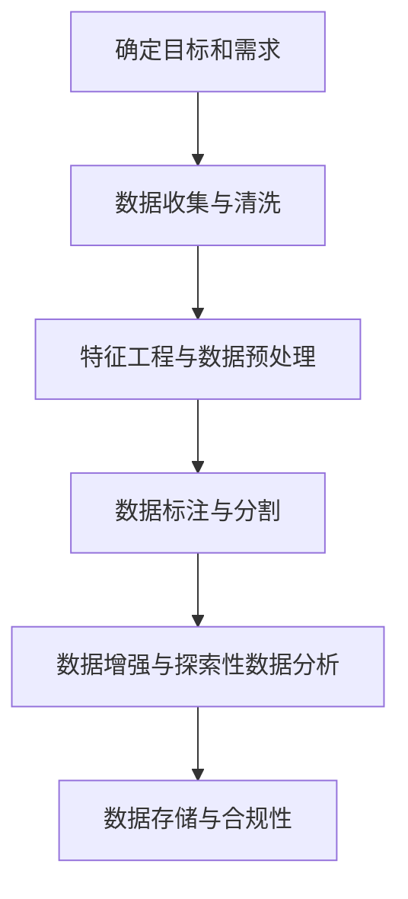
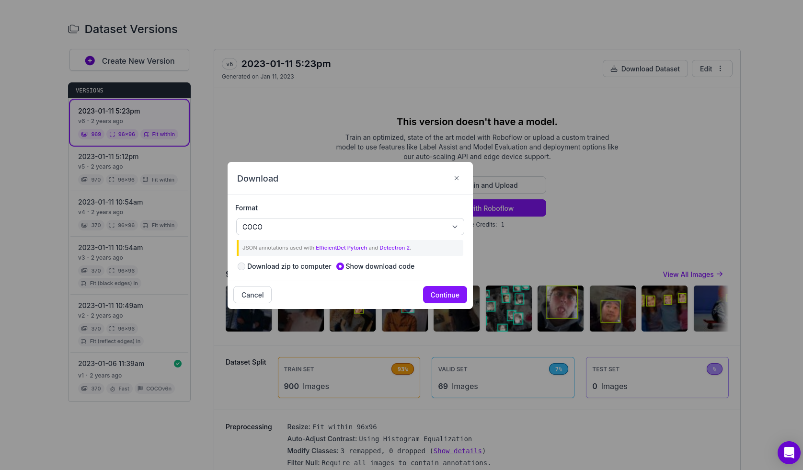

# 自制数据集

SSCMA 支持多种不同格式的数据集，您可以按照一定规则，自己制作或将其它数据集转换为支持的格式，以便在 SSCMA 中使用，一般来说，制作一个数据集通常包含以下几个部分：



首先是确定目标和需求，然后进行数据收集与清洗，这一步骤涉及从不同来源获取数据，并对其进行清洗，以去除重复项、处理缺失值和纠正错误。

随后，需要通过特征工程与数据预处理，包括从原始数据中提取有用特征、创建新特征以及对数据进行归一化、标准化和编码等预处理操作。进一步，我们进行数据标注与分割，这一步不仅包括对需要的数据进行标注，还包括将数据集划分为训练集、验证集和测试集（如果需要）。

最后是数据增强与探索性数据分析，这一阶段旨在通过数据增强提高数据多样性，并通过探索性数据分析来理解数据的分布和特征间的关系。

在所有这些步骤完成后，还需要进行数据存储，并确保整个数据集的创建和使用都符合法律法规和伦理标准。这些步骤共同确保了数据集的质量和适用性，为训练有效的机器学习模型打下了坚实的基础。在本节中，我们主要介绍数据集的标注方式。

## 标注基础

对于传统的由监督学习算法训练的模型来说，标注数据集的过程是非常关键的，它决定了训练出的模型的质量，常见的标注方法有以下几种：

- **手动标注:** 通过手工对数据集进行标注的方式，对每个样本进行标注，可以确保标注的准确性，但是速度较慢。
- **半自动标注:** 将人工标注的结果应用到其他数据集中，减少标注时间，但标注的准确性可能有所降低。
- **自动标注:** 使用一些算法模型对数据进行自动标注，例如关键字提取、文本分类等。虽然可以提高标注效率，但标注的准确性也可能会受到影响。

### 边界框标注

在目标检测任务中，边界框是一种常见的标注方式，用于标记图像中的目标位置，通常由左上角和右下角的坐标表示。边界框标注的格式通常为 `(x1, y1, x2, y2)`，其中 `(x1, y1)` 是左上角坐标，`(x2, y2)` 是右下角坐标。在进行边界框标注时，需要注意以下几个关键点：

- **标注框大小合适**：标注框应该刚好将目标物体包围，间隙不能太大也不能太小。太大或太小都可能导致模型在推理时目标框得不准，或者在视频图像检测中目标抖动严重，不能锁定。
- **标注框位置合适**：标注框的位置需要准确，不能偏太远。位置不准确会影响模型的训练效果。
- **多视角素材**：需要丰富多视角的素材，涵盖各种摄像机视角，以提高模型的通用性。
- **遮挡目标也要标注**：即使目标物体被其他物体遮挡，也需要进行标注。
- **贴边规则**：标注框需紧贴目标物体的边缘进行画框标注，不可框小或框大。
- **重叠规则**：当两个目标物体有重叠时，只要不是遮挡超过一半的就可以框，允许两个框有重叠的部分。
- **独立规则**：每一个目标物体都需要单独拉框，不能将多个目标合并在一个框内。
- **不框规则**：图像模糊不清、太暗、曝光过度或不符合项目特殊规则的不框。
- **边界检查**：确保框坐标不在图像边界上，防止载入数据或数据扩展时出现越界报错。
-  **小目标规则**：对于小目标，只要人眼能分清，都应该标出来。根据算法的需求，决定是否启用这些样本参与训练。

### 关键点标注

在指针 Meter 等与 Pose 相关的任务中，关键点标注是一种常见的标注方式，用于标记图像中的关键点位置。关键点标注的格式通常为 `(x, y)`，其中 `(x, y)` 是关键点的坐标。在进行关键点标注时，需要注意以下几个细节:

- **数据准备**：确保图像清晰无遮挡，关键点可见，以便于后续的标注工作。
- **标注规范制定**：定义关键点的类型和位置，明确标注标准，如关键点的命名规则、坐标系选择等，以保持标注的一致性和准确性。
- **标注顺序和一致性**：关键点可以不用固定的顺序，但每张图像中相同部位的关键点标注顺序应保持一致。
- **处理遮挡点**：被遮挡的点也应标注出来，以便在模型训练时能够考虑到这种情况。
- **关键点的可见性**：标注工具可能无法直接标注关键点是否可见，需要在后续处理中调整，以符合特定算法的格式要求。
- **避免重叠**：每一个关键点必须且只能落入一个框中，不落入第二个框中。
- **质量检查**：完成初步标注后，进行质量检查，确保所有关键点都被正确标注，且无遗漏或错误。

### 异常检测数据制作

在振动或音频异常检测任务中，数据集不需要进行特殊标注，但仍然需要我们手动确定参数，以保证能够训练出有效的模型。

#### N 轴加速度计

- 首先需要确定设备的采样频率，通常为 100Hz，然后根据采样频率和数据长度确定时间长度，即 sample_rate，该参数代表一条数据中包含多少数据点，注意该参数对异常检测的效果是决定性的。
- 离散的加速度计采样数据首先会经过前处理，用于减少高采样率下的信号毛刺，其中 factor 参数比较关键，调整它的 factor 参数对模型敏感性起到重要作用，该参数可以理解为抛去小数点后几位的不精确误差，数值越大则抛掉的小数点越少，越小则抛掉的小数点越多。    
    - 风扇异常检测（对挡位的变动也需要检测）：由于风扇运动规律，产生的波形较为简单，运动状态空间小，因此不应该舍去误差，数据集制作工具的前处理 factor 需要调大，否则会出现挡位变化无法判断的现象。
    - 机械臂异常检测：由于机械臂的运动过程自带一定机误差扰动，运动的状态空间过多，数据集制作工具的前处理中 factor 应当调小，否则会出现对轻微的抖动干扰不识别的现象。
- 而后需要根据数据的可视化界面，依次调整 cutoff_freq、resize、scales 相关的参数，得到清晰且稳定的图像，在此不展开讨论。

#### 麦克风

- 和 N 轴加速度计类似，首先需要确定设备的采样频率，通常为 16kHz，然后根据采样频率和数据长度确定时间长度，即 sample_rate，该参数代表一条数据中包含多少数据点，注意该参数对异常检测的效果是决定性的。
- 窗口长度（n_fft）决定了 STFT 的窗口大小，影响频率分辨率。较大的窗口可以提供更好的频率分辨率，但会降低时间分辨率，因此需要结合采样频率和数据长度来确定窗口长度。
- 重叠长度（hop_length）决定了窗口之间的重叠程度。较小的重叠可以提高时间分辨率，但可能会在窗口边界处引入伪影。
- n_mels 参数决定了梅尔滤波器组的数量，这将影响频谱图的垂直分辨率。增加 n_mels 可以提供更细致的频率信息，但也会增加计算复杂度。
- 通过调整以上参数，得到清晰且稳定的频谱图，以用于异常检测任务。


## 数据集标注工具

常用的数据标注工具包括:

- [Labelme](https://github.com/wkentaro/labelme): 一个用于图像标注的开源工具，支持多种标注格式，如 COCO、PASCAL VOC 等。
- [LabelImg](https://github.com/heartexlabs/labelImg): 适用于图像标注的工具，支持多种标注格式，如 PASCAL VOC、YOLO 等。
- [Labelbox](https://labelbox.com/): 一个在线标注工具，支持图像、文本、视频等格式的标注，具有多种标注模板和自定义标注模板功能。
- [Doccano](https://github.com/doccano/doccano): 一款用于文本分类和序列标注的开源标注工具，支持多种标注格式，如 NER、POS 等。
- [Annotator](https://github.com/openannotation/annotator): 一个轻量级的在线标注工具，支持图像、文本、音频等格式的标注。
- [VGG Image Annotator (VIA)](https://gitlab.com/vgg/via): 一个用于图像标注的开源工具，支持多种标注格式，如 PASCAL VOC、YOLO 等。
- [COCO Annotator](https://github.com/jsbroks/coco-annotator): 一个基于 Web 的图像和视频注释工具，可用于目标检测、分割、关键点标注等任务。
 
在目标检测、关键点检测等任务中，我们建议使用 Roboflow、Labelme 等专业的标注工具，以提高标注效率和标注质量。

### Roboflow 标注

1. 首先，您需要[注册 Roboflow 账号](https://app.roboflow.com/login)，然后登录 Roboflow 平台。

2. 登陆到 Roboflow 后，点击右上角的 `New Project` 创建一个新项目，选择对应的标注模式，如 Object Detection、Keypoint Detection 等。然后进入 Project 页面，点击 Upload Data 上传图像文件。

3. 在 Project 页面中，点击 `Annotate`，进入标注界面，选择 Unannotated 图像，然后在图像上拖动鼠标绘制矩形框或标记关键点，然后在左侧的属性栏中输入标签信息。（以 FOMO 为例）

    

4. 标注完成后，在 Project 页面中，点击 `Versions`，然后点击 `Create New Version` 生成版本，在生成版本的过程中，需要选择合适的 Source Images,Train/Test Split,Preprocessing 和 Augmentation 等参数，最后点击 Create 创建版本。

    

5. 完成版本创建后，在对应的版本页面中，您可以点击 `Download Dataset` 下载数据集，在弹出的对话框中选择合适的数据集格式，然后选择恰当的下载方式，将数据集下载到本地。

    

:::tip

在生成版本前，您可以先在 Project 页面中，点击 `Analyze` 分析数据集，查看数据集的统计信息，以便更好地了解数据集的特点，并针对性地调整标注和训练参数，以获得更好的训练效果。在完成以上步骤后，您也可以继续上传更多的图像文件，扩充数据集，生成新的版本，用于训练更加复杂的模型。

:::

### Labelme 标注

1. 首先，您需要安装 Labelme，可以通过以下命令进行安装：

```sh
pip install labelme
```

2. 然后，您可以通过以下命令启动 Labelme：

```sh
labelme
```

3. 在 Labelme 中，选择 OpenDir 打开图像文件夹，然后在 Edit 选择对应的标注模式，对于目标检测任务，选择 Create Rectangle，对于关键点检测任务，选择 Create Point。 如图所示，对于 PFLD 单点关键点检测任务，在图像指针的末端标注关键点。

    

4. 在标注过程中，您可以使用鼠标拖动来绘制矩形框或标记关键点，然后在右侧的属性栏中输入标签信息。

5. 标注完成后，选择 Save 保存标注结果，Labelme 会生成一个 JSON 文件，其中包含了图像的标注信息。

    :::tip
    在标注过程中 Labelme 会自动记住上次使用的标注类型，因此可以使用快捷键 `Ctrl + N` 快速信件标注。开启 File -> Save Automatically 自动保存，对于每张图片，Labelme 会在设定的文件夹下生成对应文件名的 JSON 文件。我们建议关闭 File -> Save With Image Data，以减少 JSON 文件的大小。
    :::

6. 如果事先未划分训练集、验证集和测试集，您可以手动将标注结果按照一定比例划分为训练集、验证集和测试集，然后将 JSON 文件和图像文件分别放入对应的文件夹中。

