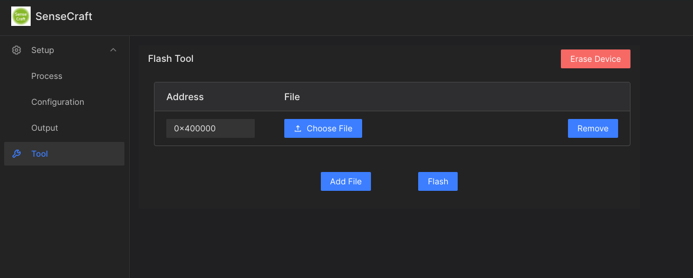

# 部署示例

SSCMA 是一个提供 No-Code 可视化模型部署工具和基于 CPP 的 SDK 的开源项目。它使用户能够轻松地将模型部署到不同的平台上，无需编写复杂的代码。

目前支持的平台包括：

| 设备 | SenseCraft-Web-Toolkit | SSCMA-Micro SDK |
| :--- | :--- | :--- |
| [Xiao ESP32S3](https://www.seeedstudio.com/XIAO-ESP32S3-Sense-p-5639.html) | ✅ | ✅ |
| [Grove Vision AI](https://www.seeedstudio.com/Grove-Vision-AI-Module-p-5457.html) | ✅ | ✅ |

## SenseCraft-Web-Toolkit

SenseCraft-Web-Toolkit 是 SSCMA 提供的可视化模型部署工具。使用该工具，用户可以通过简单的操作将模型部署到各种平台上。这个工具提供了用户友好的界面，不需要编写任何代码。

[SenseCraft-Web-Toolkit](https://seeed-studio.github.io/SenseCraft-Web-Toolkit/) 的主要特点包括：

- 可视化操作界面，无需编码技能
- 快速部署模型到不同的平台
- 支持 TFLite 格式的模型

### 部署公开模型

Step 1. 打开 SenseCraft-Web-Toolkit 网站

<!-- 

  

 -->

Step 2. 连接设备到电脑

使用带有数据传输功能的数据线将您的设备连接到您的电脑。

Step 3. 选择并连接你的设备

再进入 SenseCraft-Web-Toolkit 的主页后，我们需要首先连接设备，请点击连接按钮。

然后，浏览器将弹出一个窗口。我们需要在此处选择正确的 XIAO 端口。对于 Windows 系统，该端口通常以 COM 开头，而对于 macOS 系统，该端口通常以 /dev/tty 开头，并且会带有 USB JTAG 字样。如果您不确定正确的端口是什么，请在连接设备后刷新此页面，然后再次点击连接按钮，您将看到新的端口出现在下拉列表中。

Step 4. 选择你的模型

一旦连接按钮变为红色的断开连接按钮，我们可以从“可供使用的 AI 模型”列表中选择模型。在这里，我选择了人脸识别作为演示。选择后，点击发送按钮并等待几秒钟。

Step 5. 部署你的模型

最后，我们来到预览部分，在右上角单击一次停止按钮，然后点击调用按钮，如果一切顺利，您可以看到实时屏幕效果。

### 部署自训练模型

Step 1. 打开 SenseCraft-Web-Toolkit 网站

<!-- 

  

 -->

Step 2. 连接设备到电脑

使用带有数据传输功能的数据线将您的设备连接到您的电脑。

Step 3. 选择并连接你的设备

再进入 SenseCraft-Web-Toolkit 的主页后，我们需要首先连接设备，请点击连接按钮。

然后，浏览器将弹出一个窗口。我们需要在此处选择正确的 XIAO 端口。对于 Windows 系统，该端口通常以 COM 开头，而对于 macOS 系统，该端口通常以 /dev/tty 开头，并且会带有 USB JTAG 字样。如果您不确定正确的端口是什么，请在连接设备后刷新此页面，然后再次点击连接按钮，您将看到新的端口出现在下拉列表中。

Step 4. 上传你的模型

先点击左侧 Tool 按钮，再点击右侧的 Upload 按钮，选择你的模型文件，并将 Address 设置为 `0x400000`，最后点击 Flash 按钮，保持设备连接，等待烧录完成。

## SSCMA-Micro SDK

SSCMA 还提供了基于 CPP 的 SDK，名为 SSCMA-Micro，使用户能够将模型部署到自己的项目中。通过集成 SSCMA-Micro，用户可以方便地在自己的应用程序中使用部署好的模型。

[SSCMA-Micro](https://github.com/Seeed-Studio/SSCMA-Micro) SDK 的特点包括：

- 使用 CPP 编写，适用于各种嵌入式系统和平台
- 提供简单而强大的 API，方便用户进行模型调用和推理
- 支持 TFLite 格式的模型

