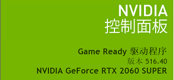
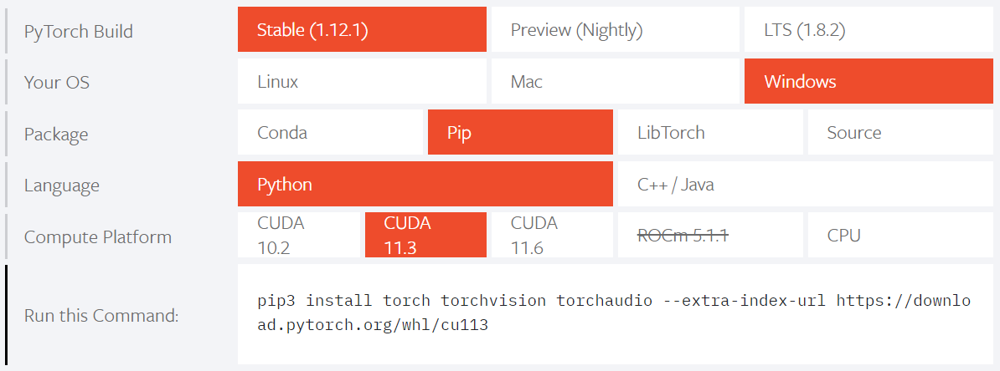

## 环境准备

首先，假设您已经在您的机器上安装了Anaconda，如果还未安装可到Anaconda[官网](https://www.anaconda.com/)下载安装。 \
如果你的机器上有GPU并且目前还未安装CUDA,cuDNN等程序，下面会指导您如何安装。

## GPU环境必要安装

**提示：** 对于机器上没有GPU或者不需要使用GPU训练推理的用户可跳过此段。

1. 查看GPU驱动

    - 首先打开NVIDIA控制面板，查看其中的显卡驱动版本号。
      如下所示：




2. 确定需要安装CUDA的版本
   -
   这时需要安装CUDA，同时参见[这张表](https://docs.nvidia.com/cuda/cuda-toolkit-release-notes/index.html#cuda-major-component-versions__table-cuda-toolkit-driver-versions)
   查看你的显卡驱动适合安装CUDA的版本

3. 到NVIDIA官网CUDA[下载页面](https://developer.nvidia.com/cuda-toolkit-archive)，下载安装所需的CUDA版本。
4. 安装cuDNN
    - 到[cuDNN下载](https://developer.nvidia.com/cudnn)页面下载合适版本，

## Python环境安装

**提示：** 我们建议使用Anaconda环境管理工具，

首先在终端中创建一个新环境用户mmlab下相关工具的依赖，

```shell
conda create -n edgelab python=3.8
conda activate edgelab
```

**提示：** 上述中`edgelab`为创建的虚拟环境的名称，其中python版本为3.8，用户可根据自己需要更改虚拟环境名称和python版本。

1. 先在安装Pytorch，torchvision，torchaudio等。
    - 首先到pytorch[官网](https://pytorch.org/)根据自己的平台的信息选择合适torch版本。
      如下图所示，Run this Command：一栏会生成相应的安装命令，将命令复制到终端执行即可安装相应的Pytorch等。
<div align="center">

</div>
2. 安装mmlab相关工具
   首先安装mmlab的自动化工具openmim以及mmcv-full

```shell
pip install openmim 
mim install mmcv-full
```

3. 之后开始安装本项目下的其他依赖库，首先进入本项目路径下，通过以下命令即可完成安装：

```shell
pip install -r requirements/requirements.txt
```

## 其他环境
- [mmdetection环境配置](https://mmdetection.readthedocs.io/zh_CN/latest/get_started.html)
- [mmclassification环境配置](https://mmclassification.readthedocs.io/zh_CN/latest/install.html)
- [mmpose环境配置](https://mmpose.readthedocs.io/zh_CN/latest/install.html)