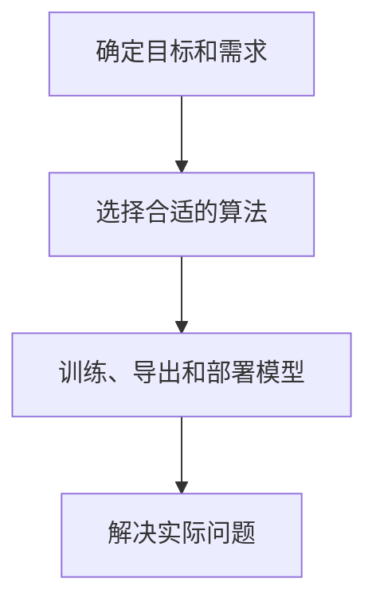
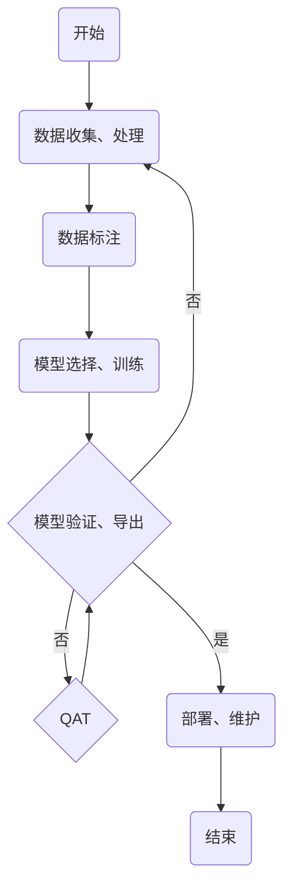

# 流程概览

使用确定算法解决实际问题的步骤并不简单，SSCMA 通常将其划分为以下几个步骤，您可以参考以下流程图来了解整个流程。

目前 SSCMA 提供了多种算法，您可以根据自己的需求选择合适的算法，然后通过训练、导出和部署模型来解决实际问题。本章将进一步介绍如何使用 SSCMA 来训练、导出和部署模型。对与常见的有监督学习任务，使用 SSCMA 的流程如下图所示：

## 数据收集、处理

收集相关数据，并进行清洗、格式化和转换，以便于后续的分析和建模。

:::tip

- 确保数据的质量和相关性。
- 处理缺失值、异常值和重复数据。
- 进行特征工程，提取有用的信息。
- 关于数据集的收集和处理方法，请参考 [SSCMA - 公共数据集](../datasets/public)。
 
:::

## 数据标注

对数据进行标注，为机器学习模型提供训练所需的标签。

:::tip

- 确保标注的准确性和一致性。
- 考虑使用众包或专业的标注团队。
- 定义清晰的标注指南。
- 关于数据集标注方法，请参考 [SSCMA - 自制数据集](../datasets/custom) 和 [SSCMA - 数据集格式与拓展](../datasets/extension)。

:::

## 模型选择、训练

选择合适的机器学习模型，并使用训练数据集对模型进行训练。

:::tip

- 根据问题类型（分类、回归等）选择合适的模型。
- 调整模型参数以优化性能。
- 使用交叉验证等方法评估模型的泛化能力。

:::

### Epochs 与 Batch Size

简单来说 Epochs 指的是将整个训练数据集完整地通过神经网络一次，即模型对所有训练样本学习一次。在训练过程中，模型通过多个 Epoch 来不断优化参数，以减少误差，提高模型的准确率，一般情况下，Epoch 数越多，模型完全收敛的概率越高，但也会增加训练时间。在 SSCMA 中，您可以通过 `max_epochs` 参数来设置训练的 Epoch 数。

Batch Size 是指在训练过程中每次迭代更新权重时所使用的样本数量，会影响训练速度和模型的性能，一般来说，其设置需要根据具体的问题和数据集来确定。

### 优化器与学习率

优化器是一种算法，用于在训练过程中调整模型的参数，以最小化损失函数，常见的优化器有 SGD、Adam、AdamW 等。优化器的选择对模型的训练速度和性能有重要影响，对于大多数情况，AdamW 优化器是一个不错的选择，您可以通过 `optim_wrapper` 参数来设置特定的优化器。

学习率是优化器在更新模型参数时的步长。它决定了在每次迭代中，参数沿着梯度下降方向移动的距离。学习率的选择对模型的训练速度和最终性能有重要影响，对于不同的算法和数据集，可能需要不同的学习率，您可以通过 `base_lr` 参数来设置学习率。我们建议您根据训练的损失曲线来调整学习率。

- 学习率过大：可能导致训练过程不稳定，甚至发散。
- 学习率过小：训练过程会非常缓慢，可能陷入局部最小值。

:::tip

关于训练细节的更多信息，请参考 [SSCMA - 自定义 - 训练与验证管线](../custom/pipeline) 和 [SSCMA - 自定义 - 优化器](../custom/optimizer)。

:::

## 模型验证、导出

使用验证和测试数据集评估模型的性能，确保模型在未见过的数据上也能表现良好。在嵌入式设备上部署模型之前，您需要将模型导出为适合目标设备的格式，此过程可能包含量化、剪枝、图优化等操作，以减小模型的体积和计算量，这些操作可能会影响模型的性能，因此对于导出后的模型，我们建议您在部署前进行验证。

:::tip

- 避免过拟合，即模型在训练数据上表现很好，但在新数据上表现不佳。
- 如果模型表现不佳，可能需要返回到数据预处理或模型选择阶段进行调整。

:::

## QAT

如果在步骤[模型验证、导出](#模型验证、导出)中发现导出的量化模型性能不佳，您可以考虑使用 SSCMA 导出工具的 QAT（量化感知训练）功能，以提高模型精度，对于经过 QAT 导出的模型，您需要重新进行验证。

## 部署、维护

将训练好的模型部署到生产环境中，使其能够处理实际的数据并提供预测。

:::tip

- 确保模型的部署环境与训练环境一致。
- 考虑模型的可扩展性和维护性。
- 定期检查模型的性能，并根据需要进行更新。

:::

